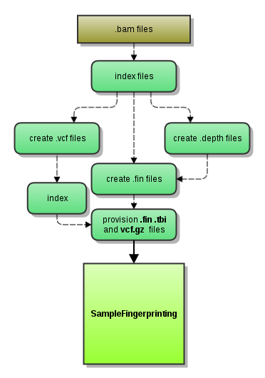

# fingerprintCollector

FingerprintCollector 2.1, workflow that generates genotype fingerprints consumed by SampleFingerprinting workflow

## Overview

Fingerprint Collector workflow produces "fingerprint" data for input alignments passed as .bam files. It is a part of the original implementation and its task is to produce all intermediate data just before creation of similarity matrix and sample swap report. The goal is to decrease the stress on the system by splitting the workflow and collecting variation data independently for each input .bam file. The below graph describes the process:



## Dependencies

* [gatk 4.1.7.0, gatk 3.6.0](https://gatk.broadinstitute.org)
* [tabix 0.2.6](http://www.htslib.org)
* [python 3.6](https://www.python.org/)


## Usage

### Cromwell
```
java -jar cromwell.jar run fingerprintCollector.wdl --inputs inputs.json
```

### Inputs

#### Required workflow parameters:
Parameter|Value|Description
---|---|---
`inputBam`|File|Input lane-level BAM file
`inputBai`|File|Index for the input BAM file
`refFasta`|String|Path to the reference fasta file
`hotspotSNPs`|String|Path to the gzipped hotspot vcf file
`runHaplotypeCaller.modules`|String|Names and versions of modules
`runDepthOfCoverage.modules`|String|Names and versions of modules
`runFinCreator.modules`|String|Names and versions of modules


#### Optional workflow parameters:
Parameter|Value|Default|Description
---|---|---|---
`outputFileNamePrefix`|String|basename(inputBam,".bam")|Output prefix, customizable. Default is the input file's basename.


#### Optional task parameters:
Parameter|Value|Default|Description
---|---|---|---
`runHaplotypeCaller.jobMemory`|Int|8|memory allocated for Job
`runHaplotypeCaller.timeout`|Int|24|Timeout in hours, needed to override imposed limits
`runHaplotypeCaller.stdCC`|Float|30.0|standard call confidence score, default is 30
`runDepthOfCoverage.jobMemory`|Int|8|memory allocated for Job
`runDepthOfCoverage.timeout`|Int|24|Timeout in hours, needed to override imposed limits
`runFinCreator.chroms`|Array[String]|["chr1", "chr2", "chr3", "chr4", "chr5", "chr6", "chr7", "chr8", "chr9", "chr10", "chr11", "chr12", "chr13", "chr14", "chr15", "chr16", "chr17", "chr18", "chr19", "chr20", "chr21", "chr22", "chrX"]|Canonical chromosomes in desired order (used for soting lines in .fin file)
`runFinCreator.timeout`|Int|10|Timeout in hours, needed to override imposed limits
`runFinCreator.jobMemory`|Int|8|memory allocated for Job


### Outputs

Output | Type | Description
---|---|---
`outputVcf`|File|gzipped vcf expression levels for all genes recorded in the reference
`outbutTbi`|File|expression levels for all isoforms recorded in the reference
`outputFin`|File|Custom format file, shows which hotspots were called as variants


## Commands
 
 This section lists command(s) run by fingerprintCollector workflow
 
 * Running fingerprintCollector
 
 GATK Haplotype Caller using a list of genotyping hotspots:
 
 ````
  gatk HaplotypeCaller
      -R REF_FASTA
      -I INPUT_BAM
      -O SAMPLE_ID.snps.raw.vcf
     --read-filter CigarContainsNoNOperator
     --stand-call-conf STD_CC
      -L HOTSPOT_SNPS
 
  bgzip -c SAMPLE_ID.snps.raw.vcf > SAMPLE_ID.snps.raw.vcf.gz
  tabix -p vcf SAMPLE_ID.snps.raw.vcf.gz 
 
 ```
 
 Depth of Coverage analysis:
 
 ```
  java -jar GenomeAnalysisTK.jar 
       -R REF_FASTA
       -T DepthOfCoverage
       -I INPUT_BAM
       -o SAMPLE_ID
       -filterRNC
       -L HOTSPOT_SNPS 
 
 ```
 
 Creation of a fingerprint file:
 
 ...
 
  Custom python code producing .fin file with hotspot calls
 
  please refer to the fingerprintCollector.wdl for source
 
 ```
 ## Support

For support, please file an issue on the [Github project](https://github.com/oicr-gsi) or send an email to gsi@oicr.on.ca .

_Generated with generate-markdown-readme (https://github.com/oicr-gsi/gsi-wdl-tools/)_
