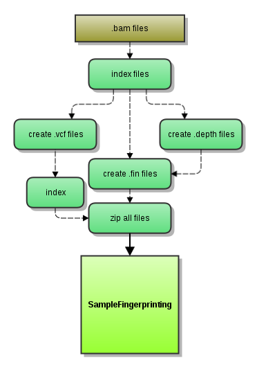

## fingerprint-collector workflow

Version 1.1.3

### Overview

Fingerprint Collector workflow produces "fingerprint" data for input alignments passed as .bam files. It is a part of the
original implementation and its task is to produce all intermediate data just before creation of similarity matrix 
and sample swap report. The goal is to decrease the stress on the system by splitting the workflow and collecting 
variation data independently for each input .bam file. The below graph describes the process:



### Dependencies

This workflow requires:

* [SeqWare](http://seqware.github.io/)
* [picard-tools](http://broadinstitute.github.io/picard/) 1.72
* [samtools](http://www.htslib.org/) 0.1.19
* [GenomeAnalysisTK](https://www.broadinstitute.org/gatk/) 2.7-2
* [tabix](http://sourceforge.net/projects/samtools/files/tabix/) 0.2.6

### Compile

```
mvn clean install
```

### Usage
After compilation, [test](http://seqware.github.io/docs/3-getting-started/developer-tutorial/#testing-the-workflow), [bundle](http://seqware.github.io/docs/3-getting-started/developer-tutorial/#packaging-the-workflow-into-a-workflow-bundle) and [install](http://seqware.github.io/docs/3-getting-started/admin-tutorial/#how-to-install-a-workflow) the workflow using the techniques described in the SeqWare documentation.

#### Options
These parameters can be overridden either in the INI file on on the command line using `--override` when [directly scheduling workflow runs](http://seqware.github.io/docs/3-getting-started/user-tutorial/#listing-available-workflows-and-their-parameters) (not using a decider). Defaults are in [square brackets].

Required:

    study_name                string      A required parameter passed by the decider
                                          or on the command line if workflow is launched
                                          manually

Input/output:

    output_prefix             dir         The root output directory
    output_dir                string      The sub-directory of output_prefix where 
                                          the output files will be moved
    manual_output             true|false  When false, a random integer will be 
                                          inserted into the path of the final file 
                                          in order to ensure uniqueness. When true,
                                          the output files will be moved to the 
                                          location of output_prefix/output_dir
                                          [false]

Optional:

    data_dir                  dir         A standard SeqWare parameter specifying the
                                          sub-directory where the output files will 
                                          be staged
    checked_snps              string      path to the vcf file (bgzipped and tabix-indexed)
                                          that contains coordinates and ids of dbSNPs
                                          used to genotype .bam files
    check_points              int         Number of snps in 'checked_snps' file
    genome_file               string      Reference fasta assembly (i.e. hg19.fa) Note that 
                                          there should be .fai and .dict files (generated with
                                          samtools and picard, respectively) in the same directory
    gatk_prefix               string      GATK prefix should point to a 'well-performing' file system
                                          for writing temporary files into it. May prevent possible
                                          failures of a workflow run
    preprocess_bam            true|false  Flag that shows if re-ordering/adding read groups are 
                                          needed for .bam files, should rarely be true
    queue                     string      Name of the (SGE) queue to schedule to [production]

#### Indexing with samtools

Indexing with samtools is required by GATK which picks up after indexes (.bai) get generated. The command (samtools index ###.bam) is executed so that index files end up together with their .bam in provisionfiles/### directory.
Building vcf files with GATK, calculating depth of coverage

We use GATK UnifiedGenotyper to call snps on our bam files with following parameters:
    
    java -jar GenomeAnalysisTK.jar 
    -R ###.fa
    -T UnifiedGenotyper 
    -I ###.bam
    -o ###.vcf
    -stand_call_conf 50.0
    -stand_emit_conf 10.0
    -dcov 50
    -L dbsnp137.hg19.402.overlap.vcf

dbsnp137.hg19.402.overlap.vcf is a file produced using dbSNP data by selecting SNPs with MAF (minor allele frequency) >=0.50.

GATK is also used to produce coverage data for SNP loci with the help of another module, DepthOfCoverage.
    
    java -jar GenomeAnalysisTK.jar 
    -R ###.fa
    -T DepthOfCoverage "
    -I ###.bam
    -o outputdir/basename 
    -L dbsnp137.hg19.402.overlap.vcf


### Output files
"fingerprint" .vcf.gz, .tbi, .fin files used by the downstream (Sample Fingerprinting) workflow

### Algorithm Overview
Fingerprint Collector uses UnifiedGenotyper to call SNPs in pre-defined 'hotspot' loci. These SNP calls are later used by SampleFingerprinting workflow to determine the relationship between analyzed samples. DeapthOfCoverage walker is used to check for loci without coverage which are essentially ignored when calculating beween-sample similarities.

#### Fin files
.fin files allow to do two things - produce glyphs with color-coded SNP calls (A,C,T,G) + two shades of gray showing either match with the reference genotype (no call) or zero coverage (too low to make a call), the later detected using output from DepthOfCoverage walker from GATK suite. Below is an excerpt from a random .fin file:

```
CHROM   POS     ID      SNP     FLAG
chr1    2391252 rs16824398      AC      C
chr1    11594400        rs2235663       TC      C
chr1    33985353        rs2641959       CC      M
chr1    34038214        rs2641962       TC      C
chr1    34052605        rs7526990       AA      M
chr1    34070826        rs12733436      GA      A
chr1    34071434        rs1874044       CT      T
chr1    34071525        rs1874045       CT      T
chr1    34189917        rs519370        CC      M
...
chr14   75485489        rs175053                N
chr14   94915743        rs200619911             N

```

The most important are positions 4 and 5 (SNP shown as REF/ALT base, if applicable) and one-letter code showing alternative base (A-T) or M for match or N for no coverage.

### Support
For support, please file an issue on the [Github project](https://github.com/oicr-gsi) or send an email to gsi@oicr.on.ca .
